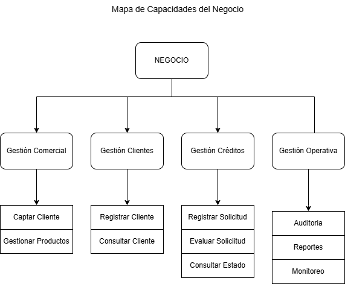
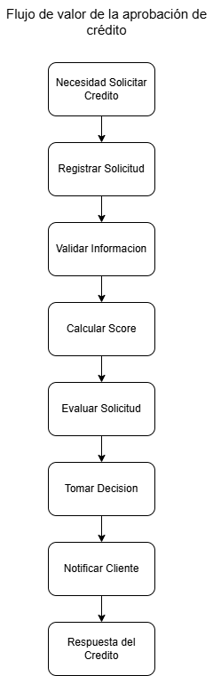
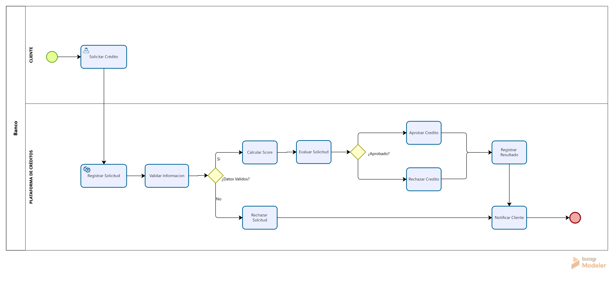
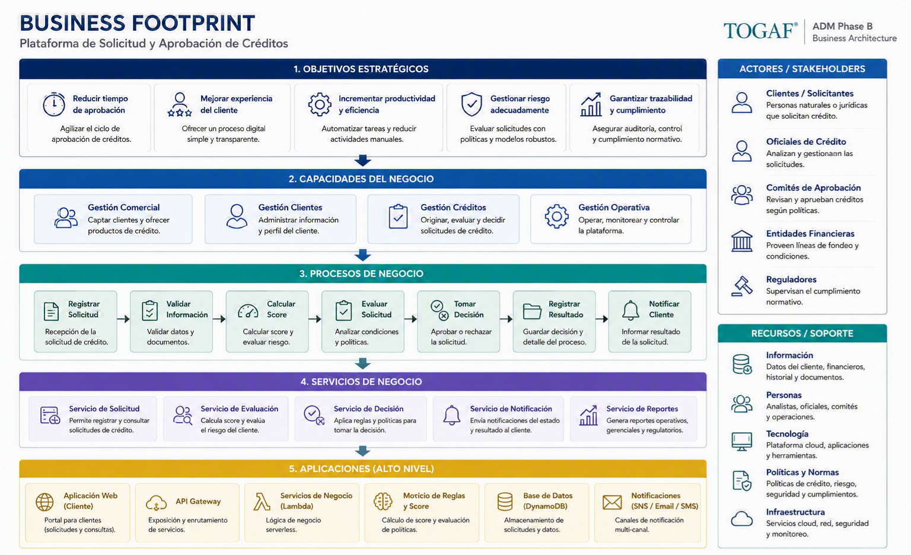

# Business Architecture

**Documento:** Business Architecture

**Framework:** TOGAF® ADM – Phase B

**Proyecto:** Plataforma de Solicitud y Aprobación de Créditos

**Versión:** 1.0

**Estado:** Draft

**Autor:** David López

---

# Control de Versiones

| Versión | Fecha      | Autor       | Descripción     |
| ------- | ---------- | ----------- | --------------- |
| 1.0     | DD/MM/YYYY | David López | Versión inicial |

---

# Tabla de Contenido

1. Propósito
2. Objetivos
3. Alcance
4. Arquitectura Actual (AS-IS)
5. Arquitectura Objetivo (TO-BE)
6. Drivers del Negocio
7. Objetivos Estratégicos
8. Capacidades del Negocio
9. Procesos de Negocio
10. Servicios de Negocio
11. Actores y Roles
12. Reglas de Negocio
13. Información del Negocio
14. Riesgos del Negocio
15. Indicadores (KPIs)
16. Artefactos de Arquitectura
17. Conclusiones

---

# 1. Propósito

Definir la Arquitectura de Negocio de la Plataforma de Solicitud y Aprobación de Créditos, identificando las capacidades, procesos, actores, servicios y reglas que soportan el logro de los objetivos estratégicos de la organización.

Este documento constituye la base para las arquitecturas de Datos, Aplicaciones y Tecnología.

---

# 2. Objetivos

* Modelar el negocio.
* Identificar capacidades.
* Definir procesos.
* Identificar actores.
* Establecer reglas de negocio.
* Mantener trazabilidad con la estrategia.

---

# 3. Alcance

Incluye:

* Originación de créditos.
* Registro de solicitudes.
* Evaluación.
* Decisión.
* Consulta del estado.

No incluye:

* Desembolso.
* Cobranza.
* Gestión documental.
* Integraciones bancarias externas.

---

# 4. Arquitectura Actual (AS-IS)

La situación actual presenta:

* Procesos parcialmente manuales.
* Validaciones distribuidas.
* Integraciones limitadas.
* Escasa trazabilidad.
* Alto tiempo de respuesta.
* Dependencia de intervención humana.

### Problemas Identificados

* Baja productividad.
* Alto costo operativo.
* Dificultad para escalar.
* Baja capacidad de auditoría.
* Mantenimiento complejo.

---

# 5. Arquitectura Objetivo (TO-BE)

La organización evolucionará hacia un proceso completamente digital caracterizado por:

* Solicitudes en línea.
* Evaluación automatizada.
* Procesamiento basado en reglas.
* Consulta en tiempo real.
* Trazabilidad completa.
* Alta disponibilidad.
* Escalabilidad automática.

---

# 6. Drivers del Negocio

## Estratégicos

* Transformación Digital.
* Crecimiento del negocio.
* Mejora de experiencia del cliente.

## Operacionales

* Automatización.
* Disminución de tiempos.
* Optimización de costos.

## Regulatorios

* Auditoría.
* Seguridad.
* Protección de datos.

---

# 7. Objetivos Estratégicos

| Objetivo                        | Resultado Esperado |
| ------------------------------- | ------------------ |
| Reducir tiempos de aprobación   | < 2 minutos        |
| Automatizar decisiones          | >95%               |
| Mejorar experiencia del cliente | Atención digital   |
| Escalar la plataforma           | Automáticamente    |
| Garantizar auditoría            | 100% trazabilidad  |

---

# 8. Capacidades del Negocio

## Business Capability Map

El siguiente diagrama representa las capacidades de negocio que soportan la Plataforma de Solicitud y Aprobación de Créditos. Estas capacidades constituyen la base para el diseño de los procesos, la arquitectura de datos, las aplicaciones y la arquitectura tecnológica.

| Atributo | Valor |
|-----------|-------|
| Tipo | Business Capability Map |
| Fase TOGAF | Phase B - Business Architecture |
| Objetivo | Representar las capacidades de negocio necesarias para soportar la solución. |

---

# 9. Procesos de Negocio

## Credit Approval Value Stream

El siguiente Value Stream representa la secuencia de actividades que generan valor para el cliente desde el momento en que solicita un crédito hasta que recibe la decisión final.

| Atributo | Valor |
|-----------|-------|
| Tipo | Value Stream |
| Fase TOGAF | Phase B - Business Architecture |
| Objetivo | Representar cómo se genera valor para el cliente durante el proceso de aprobación de créditos. |

## Credit Approval Process (BPMN)

El siguiente diagrama modela el proceso de negocio de originación y aprobación de créditos utilizando la notación BPMN 2.0. Describe el flujo operativo desde la recepción de una solicitud hasta la notificación del resultado al cliente.

| Atributo | Valor |
|-----------|-------|
| Tipo | BPMN 2.0 Process Diagram |
| Fase TOGAF | Phase B - Business Architecture |
| Objetivo | Modelar el proceso operativo de aprobación de créditos. |

---

## Business Footprint

El siguiente diagrama muestra la trazabilidad entre los objetivos estratégicos, las capacidades del negocio y los procesos que soportan la Plataforma de Solicitud y Aprobación de Créditos.

| Atributo | Valor |
|-----------|-------|
| Tipo | Business Footprint |
| Fase TOGAF | Phase B - Business Architecture |
| Objetivo | Relacionar la estrategia del negocio con las capacidades y procesos que implementan la solución. |

# 10. Servicios de Negocio

| Servicio            | Consumidor      |
| ------------------- | --------------- |
| Registrar Solicitud | Cliente         |
| Consultar Solicitud | Cliente         |
| Evaluar Solicitud   | Área de Riesgos |
| Tomar Decisión      | Sistema         |
| Notificar Cliente   | Cliente         |
| Auditoría           | Auditor         |

---

# 11. Actores y Roles

| Actor              | Rol                      |
| ------------------ | ------------------------ |
| Cliente            | Solicita crédito         |
| Analista de Riesgo | Supervisa reglas         |
| Sistema            | Ejecuta evaluación       |
| Administrador      | Configuración            |
| Auditor            | Consulta historial       |
| Arquitecto         | Gobierno de arquitectura |

---

# 12. Reglas de Negocio

| Código | Regla                                                    |
| ------ | -------------------------------------------------------- |
| RN-001 | Toda solicitud debe pertenecer a un cliente válido.      |
| RN-002 | El monto solicitado debe ser mayor que cero.             |
| RN-003 | El score debe calcularse antes de la decisión.           |
| RN-004 | Toda decisión debe quedar auditada.                      |
| RN-005 | Todo cambio de estado debe registrarse.                  |
| RN-006 | Un cliente solo puede consultar sus propias solicitudes. |

---

# 13. Información del Negocio

Las principales entidades de negocio son:

* Cliente.
* Solicitud.
* Score.
* Evaluación.
* Decisión.
* Estado.
* Historial.

Estas entidades serán desarrolladas en la fase de **Data Architecture**.

---

# 14. Riesgos del Negocio

| Riesgo                 | Mitigación               |
| ---------------------- | ------------------------ |
| Crecimiento de demanda | Arquitectura escalable   |
| Cambios regulatorios   | Gobierno de arquitectura |
| Errores humanos        | Automatización           |
| Fraude                 | Controles de seguridad   |
| Cambios funcionales    | Arquitectura desacoplada |

---

# 15. Indicadores (KPIs)

| Indicador                     | Meta         |
| ----------------------------- | ------------ |
| Tiempo promedio de aprobación | < 2 minutos  |
| Tiempo de respuesta API       | < 2 segundos |
| Solicitudes automatizadas     | >95%         |
| Disponibilidad                | 99.9%        |
| Incidentes críticos           | 0            |

---

# 16. Artefactos de Arquitectura

La Business Architecture se complementa con los siguientes artefactos:

## Catálogos

* Organization Catalog
* Actor Catalog
* Business Role Catalog
* Business Service Catalog
* Business Function Catalog

## Matrices

* Business Interaction Matrix
* Responsibility Matrix (RACI)
* Requirements Traceability Matrix

## Diagramas

* Capability Map
* Business Footprint
* Value Stream
* BPMN del proceso de originación
* ArchiMate Business Layer

Estos artefactos serán incorporados progresivamente durante la evolución de la arquitectura.

---

# 17. Conclusiones

La Arquitectura de Negocio establece las capacidades, procesos, servicios y reglas que soportan el proceso de originación y aprobación de créditos.

Esta fase proporciona la base para definir la Arquitectura de Datos, donde se modelará la información necesaria para soportar las capacidades de negocio identificadas, manteniendo la trazabilidad entre estrategia, negocio y tecnología.
