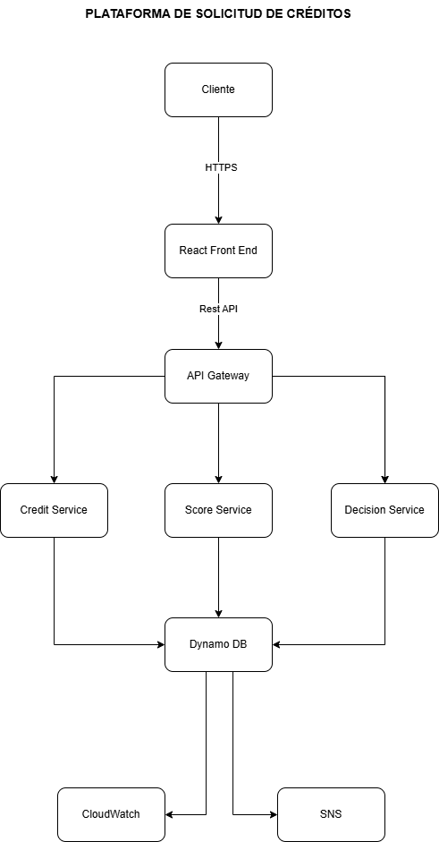

# Plataforma de Solicitud y Aprobación de Créditos

## Enterprise Architecture Repository

---

## Descripción

Este repositorio contiene la documentación de Arquitectura Empresarial y Arquitectura de Solución para la **Plataforma de Solicitud y Aprobación de Créditos**, una iniciativa diseñada para modernizar el proceso de originación y evaluación de créditos mediante una arquitectura cloud-native basada en servicios administrados de AWS.

La documentación se desarrolla siguiendo el framework **TOGAF® ADM (Architecture Development Method)** y se complementa con estándares y buenas prácticas ampliamente adoptadas en la industria, permitiendo mantener la trazabilidad desde la estrategia del negocio hasta la implementación tecnológica.

---

## Solution Overview

El siguiente diagrama presenta una vista de alto nivel de la Plataforma de Solicitud y Aprobación de Créditos, mostrando la interacción entre el usuario, la solución y los principales componentes tecnológicos.



---

# Objetivos del Repositorio

Este repositorio tiene como propósito:

* Documentar la arquitectura empresarial de la solución.
* Alinear la estrategia del negocio con la arquitectura tecnológica.
* Mantener trazabilidad entre requerimientos, procesos y componentes.
* Registrar las decisiones arquitectónicas adoptadas.
* Definir estándares y principios de arquitectura.
* Facilitar la evolución y el gobierno de la solución.
* Servir como referencia para equipos de desarrollo, operaciones y arquitectura.

---

# Alcance

La documentación cubre las siguientes disciplinas de arquitectura:

* Arquitectura de Negocio
* Arquitectura de Datos
* Arquitectura de Aplicaciones
* Arquitectura Tecnológica
* Gobierno de Arquitectura
* Decisiones Arquitectónicas
* Arquitectura Cloud
* Observabilidad
* Seguridad
* DevSecOps
* AWS Well-Architected Review

---

# Frameworks y Estándares Utilizados

## Arquitectura Empresarial

* TOGAF® ADM

## Modelado Empresarial

* ArchiMate®

## Procesos

* BPMN 2.0

## Arquitectura de Software

* C4 Model

## Documentación Arquitectónica

* Architecture Decision Records (ADR)

## Arquitectura Cloud

* AWS Well-Architected Framework

---

# Estructura del Repositorio

```text
docs/

├── 00-Governance/
├── 01-Preliminary/
├── 02-Architecture-Vision/
├── 03-Business-Architecture/
├── 04-Data-Architecture/
├── 05-Application-Architecture/
├── 06-Technology-Architecture/
├── 07-Opportunities-Solutions/
├── 08-Migration-Planning/
├── 09-Implementation-Governance/
├── 10-Architecture-Change-Management/
├── 11-Architecture-Decision-Records/
├── 12-AWS-Well-Architected/
├── 13-Appendices/
└── 14-C4-Model/
```

---

# Metodología de Trabajo

La documentación seguirá el ciclo completo del **Architecture Development Method (ADM)** propuesto por TOGAF.

Cada fase generará:

* Deliverables
* Artifacts
* Catalogs
* Matrices
* Diagrams
* Architecture Decisions

garantizando la trazabilidad entre la estrategia del negocio y la implementación técnica.

---

# Arquitectura Objetivo

La solución está orientada a una arquitectura moderna basada en los siguientes principios:

* Cloud Native
* Serverless First
* API First
* Security by Design
* Event-Driven
* Infrastructure as Code
* Observability
* Automation
* Least Privilege
* High Availability

---

# Tecnologías Consideradas

## Frontend

* React
* Vite

## Backend

* .NET 8
* ASP.NET Core Web API

## Cloud Platform

* Amazon Web Services (AWS)

## Servicios AWS

* Amazon API Gateway
* AWS Lambda
* AWS Step Functions
* Amazon DynamoDB
* Amazon Cognito
* Amazon CloudWatch
* AWS X-Ray
* Amazon EventBridge
* Amazon SNS
* Amazon S3
* Amazon CloudFront
* AWS IAM

---

# Principios de Documentación

Toda la documentación deberá cumplir los siguientes principios:

* Trazabilidad completa.
* Reutilización de artefactos.
* Separación entre negocio y tecnología.
* Independencia de proveedor cuando sea posible.
* Versionamiento.
* Gobierno de arquitectura.
* Consistencia entre documentos.

---

# Convenciones

## Diagramas

* ArchiMate
* BPMN
* Mermaid
* C4
* Draw.io

## Documentación

Todos los documentos estarán escritos en Markdown.

---

# Audiencia

Este repositorio está dirigido a:

* Arquitectos Empresariales
* Arquitectos de Solución
* Arquitectos Cloud
* Líderes Técnicos
* Equipos de Desarrollo
* Equipos DevOps
* Equipos de Seguridad
* Product Owners
* Stakeholders del Negocio

---

# Licencia

Este repositorio tiene fines académicos y de demostración de capacidades en Arquitectura Empresarial y Arquitectura de Solución, basado en buenas prácticas y estándares reconocidos por la industria.
